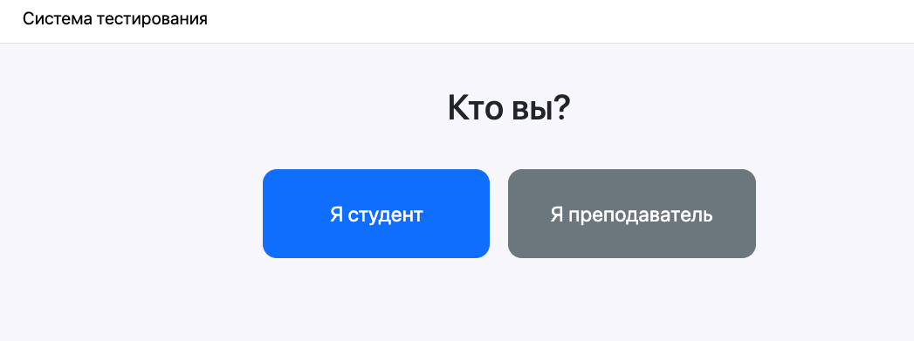
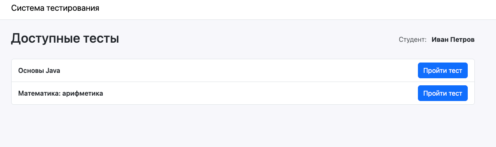
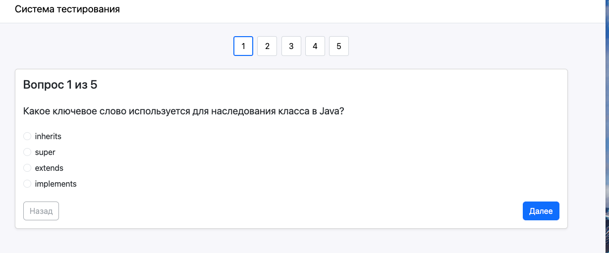
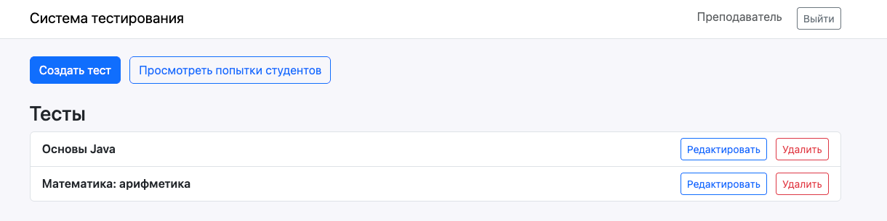
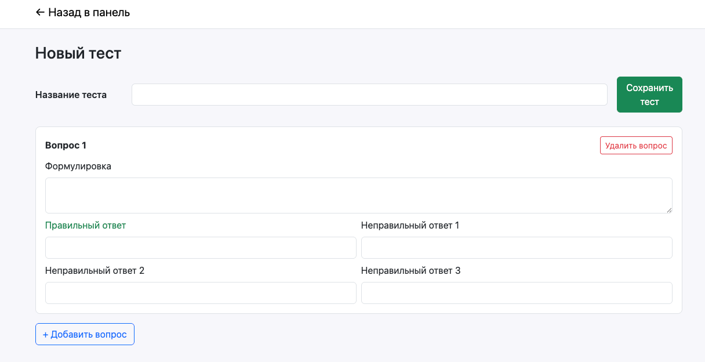
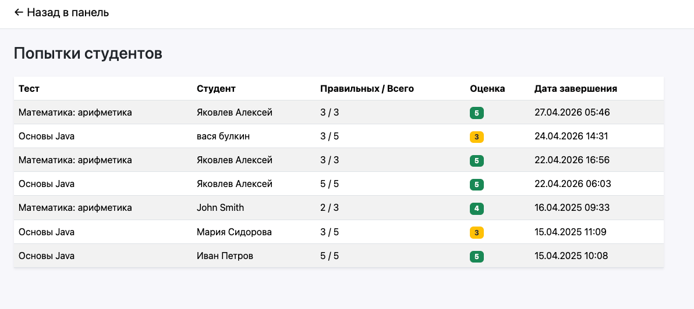
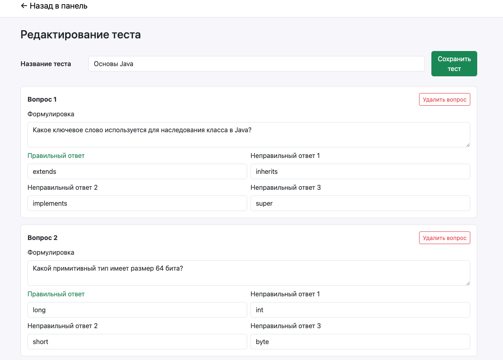

# Система тестирования студентов

Веб-приложение на Spring Boot 3 для проведения онлайн-тестирования студентов.
Поддерживает два типа пользователей: **студент** (без аккаунта, заходит по имени)
и **преподаватель** (один на всё приложение, логинится по паролю из конфига).

## Возможности

- Студент: вводит имя и фамилию, выбирает тест, проходит его с пагинацией и
  возможностью возврата к предыдущим вопросам, получает оценку по шкале 2–5.
- Преподаватель: создаёт/редактирует/удаляет тесты с произвольным числом
  вопросов, смотрит список попыток всех студентов.
- Варианты ответа на вопрос перемешиваются **один раз при старте теста** —
  при возврате к вопросу порядок сохраняется.
- Попытка сохраняется в БД **только в момент нажатия «Завершить тест»**.
  До этого всё состояние живёт в HTTP-сессии.

## Требования к окружению

- Docker 20+
- Docker Compose v2

Java и Maven не нужны на хосте, сборка идёт внутри контейнера.

## Запуск

```bash
docker compose up --build
```
После старта приложение доступно по адресу: **http://localhost:8080**

Порты:
- `8080` — веб-приложение;
- `5432` — PostgreSQL (на случай, если хочется подключиться напрямую).

## Учётные данные преподавателя

По умолчанию (из `application.yml`):

| Поле   | Значение     |
|--------|--------------|
| Логин  | `teacher`    |
| Пароль | `teacher123` |

Пароль хранится в `application.yml` в открытом виде и хэшируется BCrypt при старте
приложения.

## Демо-данные

Миграция `V2__demo_data.sql` автоматически заполняет БД:

- **Тест 1: «Основы Java»** — 5 вопросов на базовые знания Java.
- **Тест 2: «Математика: арифметика»** — 3 простых вопроса.
- 3 тестовые попытки от разных студентов с разными оценками — чтобы
  страница «Попытки студентов» выглядела живой при старте приложения.

## Архитектура

Монолит:

```
src/main/java/com/example/testing/
├── TestingApplication.java
├── config/              — Spring Security, properties
├── controller/          — 5 контроллеров (Home, Student, TeacherAuth, TeacherTest, TeacherAttempt)
├── service/             — бизнес-логика (TestService, AttemptService, GradingService, ...)
├── repository/          — Spring Data JPA репозитории
├── entity/              — JPA-сущности (Test, Question, Attempt)
├── dto/                 — DTO для форм
├── validation/          — валидатор имени студента
└── session/             — состояние попытки в HTTP-сессии
```

Шаблоны Thymeleaf — в `src/main/resources/templates/`, Flyway-миграции — в
`src/main/resources/db/migration/`.

## HTTP-эндпоинты

| Метод | Путь                                   | Доступ        | Описание                              |
|-------|----------------------------------------|---------------|---------------------------------------|
| GET   | `/`                                    | все           | Главная с двумя кнопками              |
| POST  | `/student/name`                        | все           | Принимает имя студента                |
| GET   | `/student/tests`                       | студент*      | Список доступных тестов               |
| POST  | `/student/attempts/start`              | студент*      | Стартует попытку                      |
| GET   | `/student/attempts/current?question=N` | студент*      | Показ вопроса №N                      |
| POST  | `/student/attempts/navigate`           | студент*      | Переход между вопросами               |
| POST  | `/student/attempts/finish`             | студент*      | Завершить тест (запись в БД)          |
| GET   | `/student/attempts/{id}/result`        | студент*      | Экран результата                      |
| GET   | `/teacher/login`                       | все           | Форма входа преподавателя             |
| POST  | `/teacher/login`                       | все           | Обрабатывается Spring Security        |
| POST  | `/teacher/logout`                      | teacher       | Выход                                 |
| GET   | `/teacher/dashboard`                   | teacher       | Панель администратора                 |
| GET   | `/teacher/tests/new`                   | teacher       | Форма создания теста                  |
| POST  | `/teacher/tests`                       | teacher       | Сохранить новый тест                  |
| GET   | `/teacher/tests/{id}/edit`             | teacher       | Форма редактирования                  |
| POST  | `/teacher/tests/{id}`                  | teacher       | Сохранить изменения теста             |
| POST  | `/teacher/tests/{id}/delete`           | teacher       | Удалить тест                          |
| GET   | `/teacher/attempts`                    | teacher       | Список попыток студентов              |

\* — для студенческих маршрутов нужно, чтобы имя было положено в HTTP-сессию
через `POST /student/name`.

## Запуск тестов

```bash
./mvnw test
# или
mvn test
```

Модульные тесты используют **H2 in-memory** (без Postgres). Каждый тест
снабжён Javadoc-комментарием на русском, описывающим, что именно проверяется.

Покрыты:
- `GradingServiceTest` — 11 тестов, все пограничные случаи формулы оценки
  (0.49, 0.50, 0.64, 0.65, 0.79, 0.80, 1.00) + негативные сценарии.
- `StudentNameValidatorTest` — 13 тестов: кириллица, латиница, дефис,
  цифры, спецсимволы, превышение длины, null, два пробела, три слова, и т.д.
- `TestServiceTest` — 5 тестов через Mockito: валидация названия и вопросов,
  отбрасывание частично заполненных вопросов.
- `AttemptServiceTest` — 3 теста: старт попытки, подсчёт правильных ответов,
  сохранение в БД при завершении.
- `AnswerShuffleServiceTest` — 4 теста: иммутабельность, полнота, детерминизм
  при одинаковом seed, возможность получить порядок, отличный от исходного.

## Структура проекта

```
testing-system/
├── pom.xml
├── Dockerfile                 — multi-stage (maven build → temurin-21-jre-alpine)
├── docker-compose.yml         — postgres:16-alpine + app, healthcheck, named volume
├── README.md
└── src/
    ├── main/
    │   ├── java/com/example/testing/   
    │   └── resources/
    │       ├── application.yml
    │       ├── db/migration/
    │       │   ├── V1__init_schema.sql
    │       │   └── V2__demo_data.sql
    │       └── templates/
    │           ├── index.html
    │           ├── fragments/layout.html
    │           ├── student/  (tests, question, result)
    │           └── teacher/  (login, dashboard, test-form, attempts)
    └── test/
        ├── java/com/example/testing/   — юнит-тесты
        └── resources/
            ├── application.yml         — H2 для тестов
            └── db/migration-test/V1__init_schema.sql
```
## Обзор интерфейса

**Меню при входе на страницу**


**Главная страница (для студента)**


**Страница прохождения тест (для студента)**


**Главная страница (для преподавателя)**


**Страница создания теста (для преподавателя)**


**Страница просмотра попыток (для преподавателя)**


**Страница редактирования теста (для преподавателя)**

